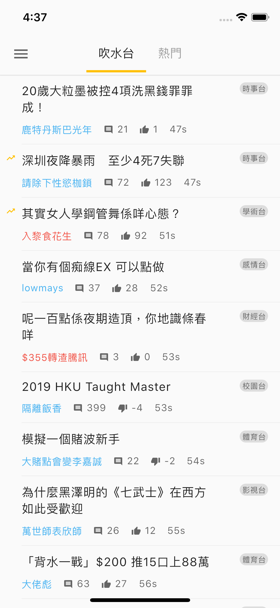
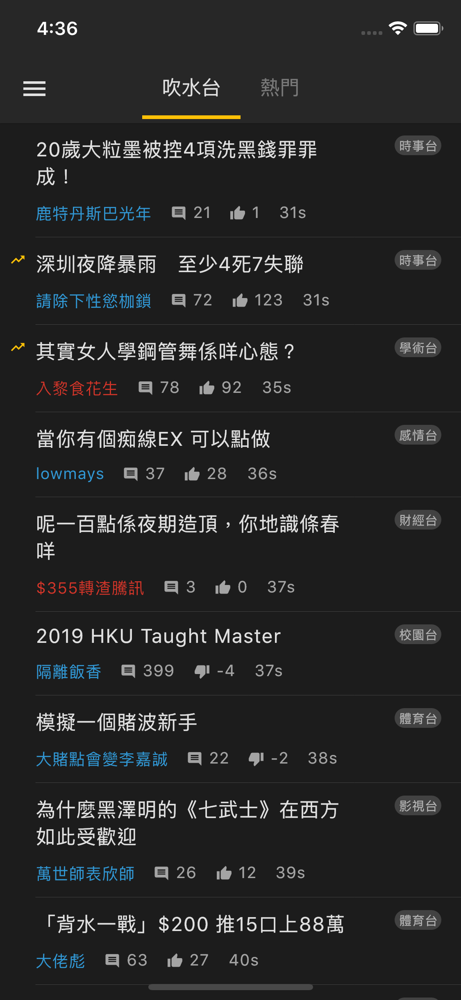
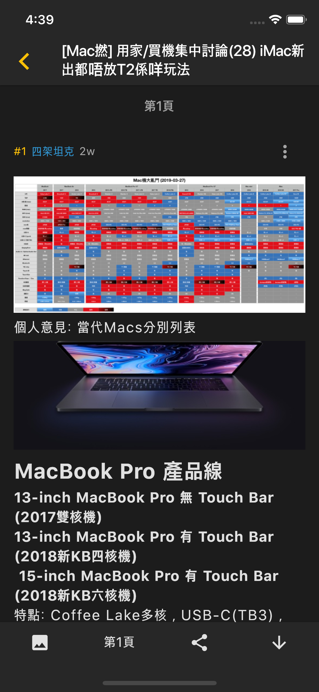

## LIHKG-Flutter
An unofficial [LIHKG](https://lihkg.com) mobile client build with [Flutter](https://flutter.io).

Welcome any PR

## Get started
1. Install [Flutter](https://flutter.io/setup/)
2. Clone this repo
3. Move to project directory
4. Run `flutter packages get`
5. Run `flutter run`

`flutter run` will run the application on simulator

For better performance, you can run the application in release mode by using `flutter run --release`

Find out more in [here](https://flutter.dev/docs/testing/build-modes)

## Functions
- [x] read post
- [x] change category
- [x] media mode
- [x] search
- [x] in-app browser
- [x] light / dark theme
- [x] changing font size
- [x] inline image (working but buggy, waiting for Flutter support, read more [here](https://github.com/flutter/flutter/issues/2022))
- [x] scroll to bottom in post (working but buggy)
- [x] auto linking in post (working but buggy)
- [ ] login
- [ ] any function that requires login
- [ ] reading history
- [ ] scroll to last read position
- [ ] refresh in post
- [ ] local emoji

## Screenshot
<div>
    
    
    
    
</div>

## License
```
MIT License

Copyright (c) 2019 skipness

Permission is hereby granted, free of charge, to any person obtaining a copy
of this software and associated documentation files (the "Software"), to deal
in the Software without restriction, including without limitation the rights
to use, copy, modify, merge, publish, distribute, sublicense, and/or sell
copies of the Software, and to permit persons to whom the Software is
furnished to do so, subject to the following conditions:

The above copyright notice and this permission notice shall be included in all
copies or substantial portions of the Software.

THE SOFTWARE IS PROVIDED "AS IS", WITHOUT WARRANTY OF ANY KIND, EXPRESS OR
IMPLIED, INCLUDING BUT NOT LIMITED TO THE WARRANTIES OF MERCHANTABILITY,
FITNESS FOR A PARTICULAR PURPOSE AND NONINFRINGEMENT. IN NO EVENT SHALL THE
AUTHORS OR COPYRIGHT HOLDERS BE LIABLE FOR ANY CLAIM, DAMAGES OR OTHER
LIABILITY, WHETHER IN AN ACTION OF CONTRACT, TORT OR OTHERWISE, ARISING FROM,
OUT OF OR IN CONNECTION WITH THE SOFTWARE OR THE USE OR OTHER DEALINGS IN THE
SOFTWARE.
```
